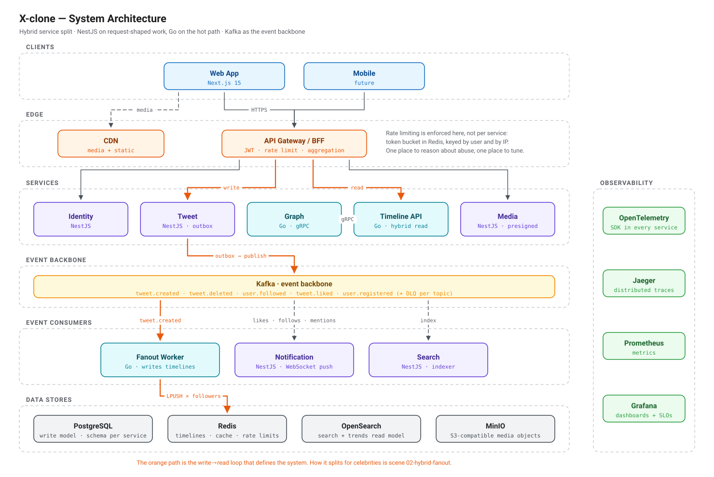
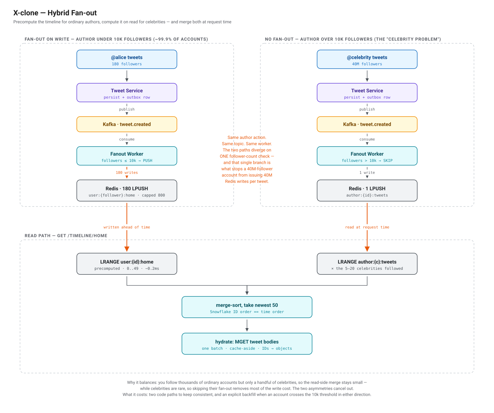

# X-clone

A Twitter/X clone built to learn distributed systems by implementing the techniques that
actually make Twitter's read path survive its load — hybrid fan-out, precomputed timelines,
an asynchronous event backbone, Snowflake IDs, and CQRS.

<picture>
  <source media="(prefers-color-scheme: dark)" srcset="docs/diagrams/01-system-architecture-dark.svg">
  
</picture>

> **On scale, up front.** This architecture targets roughly **150M DAU**. The deployment
> anyone would realistically run is **1M DAU** — which works out to ~6 tweet writes/s and
> ~350 timeline reads/s, and would fit comfortably on a single tuned monolith with one
> Postgres and one Redis, with 100–500× headroom.
>
> The over-engineering is deliberate: distributed-systems practice is the point. But a
> project that claims "Twitter scale" without quantifying the cost is not being honest, so
> [`docs/02-capacity-estimation.md`](docs/02-capacity-estimation.md) carries three sizing
> tiers and a trigger table naming the measured threshold at which each component stops
> being premature.

**Status:** Phase 1 — infrastructure baseline. One `docker compose up` brings up Postgres,
Redis, Redpanda and the observability stack, all healthchecked, with a smoke test that
asserts the pipeline actually works rather than that the containers are running. Services
themselves start in Phase 2: in a distributed system the expensive mistakes are the service
boundaries and the shape of the data flow, and those were nearly free to change while they
were still a diagram.

## The interesting problem

Everything in a Twitter clone is ordinary CRUD except one thing:

> You follow 500 accounts. Show the 50 most recent tweets among them, in time order, in
> under 200 ms, while a million other people ask the same thing.

There are three answers, and two of them are traps.

**Fan-out on read** computes the timeline at request time. Writes cost one INSERT; reads
touch 500 authors and merge-sort. The cost grows with how many accounts you follow — so your
most engaged users get your worst latency.

**Fan-out on write** precomputes a timeline for every follower when a tweet is posted. Reads
become a single `LRANGE` at ~0.2 ms. But an account with 40 million followers turns one
tweet into 40 million Redis writes, saturating the workers and stalling *everyone's*
timeline. The failure is a cliff, not a slope.

**Hybrid** — what this builds — splits on a follower threshold:

<picture>
  <source media="(prefers-color-scheme: dark)" srcset="docs/diagrams/02-hybrid-fanout-dark.svg">
  
</picture>

It works because two asymmetries cancel out: you follow **thousands** of ordinary accounts
but only a **handful** of celebrities, so the read-side merge stays small — while celebrities
are **rare**, so skipping their fan-out removes most of the write cost.

It costs two code paths, and an explicit backfill when an account crosses the threshold.
Full reasoning in [`docs/concepts/hybrid-fanout.md`](docs/concepts/hybrid-fanout.md).

## Architecture at a glance

Eight services, cut where the reasons to change genuinely diverge — not where the nouns do.

| Service | Runtime | Why it is its own boundary |
|---|---|---|
| **Gateway / BFF** | NestJS | The only public surface: JWT, rate limiting, aggregation |
| **Identity** | NestJS | Changes for security reasons, on a different cadence from features |
| **Graph** | Go | Queried on *every* fan-out — the highest-QPS internal service |
| **Tweet** | NestJS | Write-model system of record; owns ID generation and the outbox |
| **Timeline API** | Go | Latency-critical read path; merge-sort and hydration |
| **Fanout Worker** | Go | Throughput-critical; scales on Kafka lag, not request rate |
| **Media** | NestJS | Must be able to fail without blocking tweets |
| **Notification** | NestJS | Long-lived WebSocket connections — a different resource profile |
| **Search** | NestJS | A derived read model, fully rebuildable from Kafka |

**Go on the hot path, NestJS everywhere else** — because fan-out issuing thousands of
pipelined Redis writes per second and a CRUD service validating a profile update are not the
same workload ([ADR 0002](docs/adr/0002-go-on-the-hot-path.md)).

**Timeline API and Fanout Worker are separate deployables** despite sharing a domain: one
scales with readers, the other with writers and consumer lag.

## Stack

| Layer | Choice |
|---|---|
| Frontend | Next.js 15, TypeScript, Tailwind, TanStack Query |
| Services | NestJS (Clean Architecture) · Go |
| Internal transport | gRPC + protobuf |
| Events | Kafka — Redpanda locally |
| Write model | PostgreSQL, schema per service |
| Read models | Redis (timelines, cache) · OpenSearch (search, trends) |
| Objects | MinIO (S3-compatible) |
| Observability | OpenTelemetry → Jaeger, Prometheus, Grafana |
| Load testing | k6 |

## Documentation

Written to be read in this order.

| Document | What it answers |
|---|---|
| [System design](docs/01-system-design.md) | Requirements, service decomposition, write and read paths, failure modes |
| [Capacity estimation](docs/02-capacity-estimation.md) | **The numbers behind every decision** — three tiers and the trigger table |
| [Data model](docs/03-data-model.md) | Schemas, keys, denormalisation, sharding plan |
| [API contracts](docs/04-api-contracts.md) | REST edge, internal gRPC, Kafka event contracts |
| [Roadmap](docs/05-roadmap.md) | Twelve phases, and what each one teaches |
| [ADRs](docs/adr/) | Every decision, each with what was rejected and at what cost |
| [Concepts](docs/concepts/) | The ideas themselves — problem, options, choice, **cost** |
| [Diagrams](docs/diagrams/) | Sources, and how to rebuild them |

Every concept doc follows one shape: **the problem → the naive options and exactly where
each breaks → the choice → what it costs.** The last section is the one that matters —
anyone can list patterns; knowing what each takes from you is the part that transfers.

## Roadmap

| # | Phase | Teaches |
|---|---|---|
| 0 | ~~Design & documentation~~ | Deciding boundaries while they are cheap to move |
| 1 | **Infrastructure baseline** ← *here* | Running a distributed environment locally |
| 2 | Identity + Gateway | Token rotation, token-bucket rate limiting |
| 3 | Tweet + Graph | Snowflake IDs, the outbox pattern, protobuf contracts |
| 4 | **Fanout Worker + Timeline API** | Hybrid fan-out, Kafka consumers, idempotency |
| 5 | Frontend | Infinite scroll, designing around eventual consistency |
| 6 | Media | Keeping bytes off the API path; failure isolation |
| 7 | Notifications | Long-lived connections, fan-out to sockets |
| 8 | Search + trends | Derived read models, index rebuilds |
| 9 | Observability | Reading a distributed trace |
| 10 | **Load testing** | Turning "it scales" into a number with hardware attached |
| 11 | Kubernetes | Autoscaling signals, partial failure |

Phase 4 comes before the frontend on purpose. Fan-out is the reason this project exists; a
pretty timeline over a naive query would not be.

## Will it hold up?

Phase 10 answers that with a measurement rather than a claim. The k6 suite targets the Tier
2 peak — **~3,000 RPS, p99 < 200 ms on `GET /timeline/home`**, realistic 85/5/10 traffic mix
with a hot-key distribution — and this README will publish the Grafana output, the k6
summary, **and the hardware it ran on**. A latency number without its hardware is not a
result.

*Results appear here after Phase 10.*

## Local development

**Requires** Docker, Node 20+, pnpm 9+, and Go 1.24+.

```bash
cp .env.example .env
pnpm install

pnpm preflight     # every port free? names who holds the ones that are not
pnpm up            # 8 containers, ~1.2 GB, healthy in ~20 s
pnpm smoke         # 15 assertions that the environment actually works
```

`pnpm up` starts the core set. MinIO and OpenSearch are not consumed until Phases 6 and 8
and hold ~1 GB between them, so they sit behind profiles:

```bash
pnpm up:full       # + MinIO and OpenSearch
pnpm down          # stop, keep data
pnpm reset         # stop and destroy every volume
```

| | | | |
|---|---|---|---|
| Grafana | [:3001](http://localhost:3001) | Postgres | `:5432` |
| Jaeger | [:16686](http://localhost:16686) | Redis | `:6379` |
| Prometheus | [:9090](http://localhost:9090) | Kafka (Redpanda) | `:9092` |
| Redpanda Console | [:8090](http://localhost:8090) | OTLP | `:4317` gRPC · `:4318` HTTP |

The full port map lives in
[`docs/diagrams/03-local-environment-light.svg`](docs/diagrams/), which is the source of
truth `compose.yml` follows — not the other way round. `pnpm preflight` enforces it: ports
are global state on a laptop, and `bind: address already in use` is a bad way to find that
out.

Why these containers and not a VM or a local Kubernetes cluster — and the two things that
are not obvious about wiring them (Kafka's advertised listeners, and why a healthcheck is
not a readiness check) — are in
[`docs/concepts/local-environment.md`](docs/concepts/local-environment.md). What each
configuration file teaches its container is in [`infra/README.md`](infra/README.md).

## License

MIT — see [LICENSE](LICENSE).
