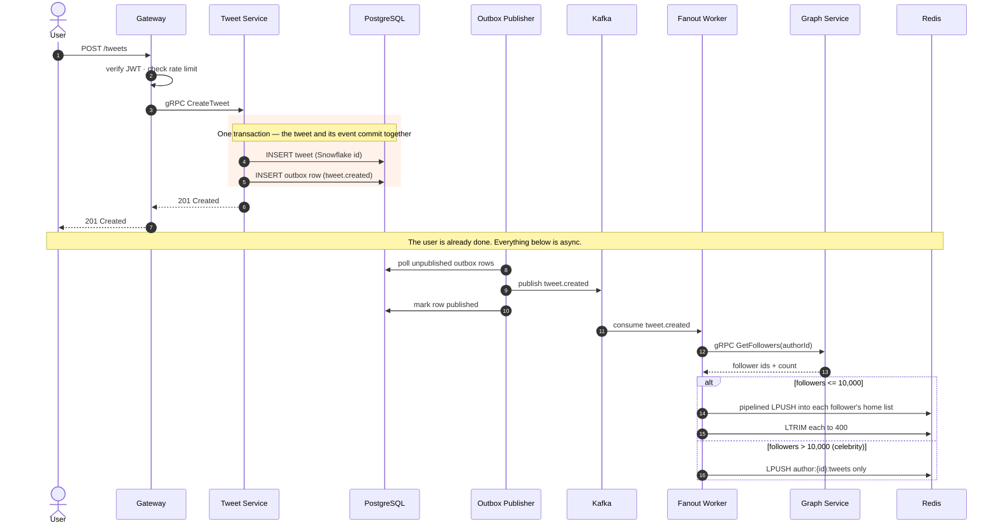
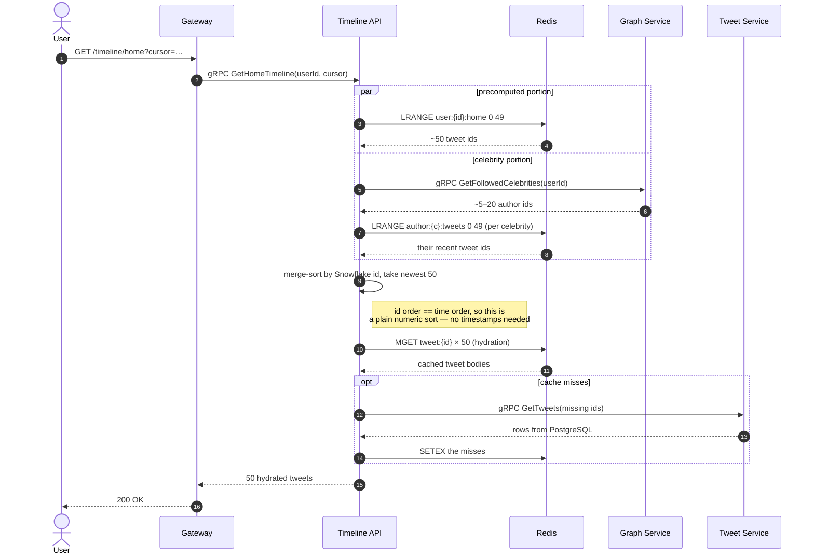

# System Design

## Scope

A Twitter/X clone: accounts, a social graph, tweets with replies/retweets/quotes/likes,
media, a home timeline, search with trending topics, and real-time notifications.

Built as a **learning project**. That framing is not an excuse for sloppiness — it is a
constraint that changes what "good" means. A production team should ship the smallest
thing that works. Here, the goal is to encounter the problems that only appear in
distributed systems, so the design deliberately walks into them.

Read [`02-capacity-estimation.md`](02-capacity-estimation.md) first if you have not.

## Requirements

### Functional

| | Capability |
|---|---|
| F1 | Register, log in, refresh sessions, manage a profile |
| F2 | Follow and unfollow; list followers and following |
| F3 | Post, delete, reply, retweet, quote, like |
| F4 | Attach images and video to a tweet |
| F5 | Read a home timeline of tweets from followed accounts, newest first |
| F6 | Read any user's profile timeline |
| F7 | Search tweets and users; browse trending topics |
| F8 | Receive notifications in real time |

### Non-functional

| | Target | Why this number |
|---|---|---|
| N1 | `GET /timeline/home` p99 < 200 ms | Below the threshold where a feed feels laggy |
| N2 | `POST /tweets` p99 < 300 ms | The write returns before fan-out; only persistence is on the critical path |
| N3 | Timeline is eventually consistent, converging in < 5 s | Async fan-out makes this a deliberate trade, not an accident |
| N4 | A failure in Media, Search or Notifications must not prevent tweeting | Secondary features may not take down the primary one |
| N5 | Every request traceable end-to-end across services | Without this, debugging a distributed system is guesswork |
| N6 | Sustains ~3,000 RPS at Tier 2 peak | Measured in Phase 10, not asserted |

N4 is the requirement that most shapes the architecture. It is why the write path
publishes an event and returns, instead of calling four services and hoping.

## The central problem

Everything else is ordinary CRUD. This is not:

> You follow 500 accounts. Show the 50 most recent tweets among them, in time order,
> in under 200 ms, while a million other people ask the same thing.

### The three answers

**Fan-out on read (pull).** At request time, query the tweets of everyone you follow and
merge-sort. Writes are trivially cheap: one INSERT. Reads are brutal — 500 partitions
touched per request, and the cost *grows with how many accounts you follow*, so your most
engaged users get your worst latency. That is exactly backwards.

**Fan-out on write (push).** When someone tweets, push the tweet ID into a precomputed
list for each follower. Reads become a single `LRANGE` — around 0.2 ms. Writes now cost
one operation per follower, which is fine at 200 followers and catastrophic at 40 million:
a single celebrity tweet would issue 40M Redis writes, saturating the worker pool and
delaying *everyone's* timeline. This is the classic celebrity problem.

**Hybrid — what this project builds.** Fan out on write below a follower threshold
(10,000 here); above it, skip fan-out entirely and merge the author's own tweet list in at
read time.

It works because two asymmetries cancel: you follow *thousands* of ordinary accounts but
only a *handful* of celebrities, so the read-side merge stays small — while celebrities
are *rare*, so skipping their fan-out removes most of the write cost.

It costs two code paths that must stay consistent, and an explicit backfill when an
account crosses the threshold in either direction.

See [`diagrams/02-hybrid-fanout-light.svg`](diagrams/) and
[`concepts/hybrid-fanout.md`](concepts/hybrid-fanout.md).

## Service decomposition

Services are cut where the *reasons to change* diverge, not where the nouns do.

| Service | Runtime | Owns | Why this is a boundary |
|---|---|---|---|
| **Gateway / BFF** | NestJS | — | The only public surface. JWT verification, rate limiting, response aggregation |
| **Identity** | NestJS | `users`, `credentials`, `sessions` | Changes for security reasons on a different cadence from product features |
| **Graph** | Go | `follows`, follower counts | Queried on *every* fan-out — the highest-QPS internal service |
| **Tweet** | NestJS | `tweets`, `likes`, `retweets` | The write-model system of record; owns ID generation and the outbox |
| **Timeline API** | Go | reads Redis timelines | Latency-critical read path; merge-sort and hydration are CPU/IO bound |
| **Fanout Worker** | Go | writes Redis timelines | Throughput-critical; scales on Kafka lag, independently of request traffic |
| **Media** | NestJS | upload metadata | Must be able to fail without blocking tweets (N4); bursty, IO-heavy |
| **Notification** | NestJS | `notifications` | Naturally async; holds long-lived WebSocket connections, a different resource profile |
| **Search** | NestJS | OpenSearch indices | A derived read model — fully rebuildable from Kafka |

**Timeline API and Fanout Worker are separate deployables despite sharing a domain.** One
scales with reader traffic, the other with writer traffic and consumer lag. Coupling them
would mean scaling both for whichever spikes first.

### Communication

- **Synchronous:** gRPC with protobuf between services. Fanout→Graph runs constantly, and
  protobuf forces explicit, versioned contracts.
- **Asynchronous:** Kafka. Topics: `tweet.created`, `tweet.deleted`, `user.followed`,
  `tweet.liked`, `user.registered` — each with a dead-letter topic.
- **Public edge:** REST over HTTPS, plus WebSocket for notifications.

## The write path

Two details carry most of the weight:

**The transaction boundary.** The tweet row and the outbox row commit together. Writing to
Postgres and publishing to Kafka as two separate operations is the *dual-write problem*: if
the database commits and the broker call fails, the event is lost with no trace. The outbox
makes "the tweet exists" and "the event will be published" the same atomic fact. See
[`concepts/transactional-outbox.md`](concepts/transactional-outbox.md).

**The response is sent before fan-out.** That is the entire reason the write p99 can be
300 ms while fan-out to 40,000 followers takes seconds.

## The read path

**Why the timeline stores IDs and not tweets.** A tweet body copied into 200 followers'
timelines is 200 copies to keep in sync when its like count changes — and 200× the memory.
Storing IDs means one canonical copy, hydrated fresh on read. See
[`concepts/timelines-as-id-lists.md`](concepts/timelines-as-id-lists.md).

**Why merge-sort is cheap.** Snowflake IDs put a millisecond timestamp in the high bits, so
sorting by ID *is* sorting by time. No timestamp lookups, no secondary index. See
[`concepts/snowflake-ids.md`](concepts/snowflake-ids.md).

## Failure modes

Designing the happy path is the easy half.

| Failure | Effect | Mitigation |
|---|---|---|
| Fanout Worker falls behind | Timelines go stale; nothing is lost | Alert on consumer lag; scale consumers; Kafka retains the backlog |
| Redis loses timelines | Cold read path for everyone | Timelines are a cache — rebuild from Postgres on miss. Never the source of truth |
| Graph Service down | Fan-out stalls; reads degrade | Fan-out retries from the Kafka offset; Timeline API serves the precomputed portion only |
| Kafka unavailable | Outbox rows accumulate, unpublished | Writes keep succeeding; publisher drains the backlog on recovery |
| Duplicate event delivery | A tweet could appear twice in a timeline | Consumers are idempotent — `LPUSH` guarded by a dedupe check on tweet id |
| Media Service down | No new uploads | Text tweets unaffected (N4) |
| Celebrity crosses 10k followers | Their tweets in flight are handled inconsistently | Explicit backfill job on threshold crossing |

The recurring theme: **every derived store is rebuildable**. Redis timelines, OpenSearch
indices, and counter caches can all be reconstructed from Postgres plus the Kafka log. Only
Postgres and the object store hold anything irreplaceable.

## What this design deliberately does not do

Named so that nobody has to guess whether they were forgotten:

- **No sharding yet.** One Postgres per service, schema-per-service locally. Sharding
  arrives when the trigger table says so.
- **No multi-region.** Single region until latency, not ambition, demands otherwise.
- **No ML ranking.** The timeline is reverse-chronological. Ranking is a different problem
  wearing the same clothes.
- **No DMs, lists, spaces, or ads.**
- **No service mesh.** gRPC plus OpenTelemetry covers what a mesh would provide here,
  without the operational surface.

## See also

- [`02-capacity-estimation.md`](02-capacity-estimation.md) — the numbers behind every choice above
- [`03-data-model.md`](03-data-model.md) — schemas, keys, and denormalisation
- [`04-api-contracts.md`](04-api-contracts.md) — the REST edge and internal gRPC surface
- [`adr/`](adr/) — every decision, with what was rejected and why
