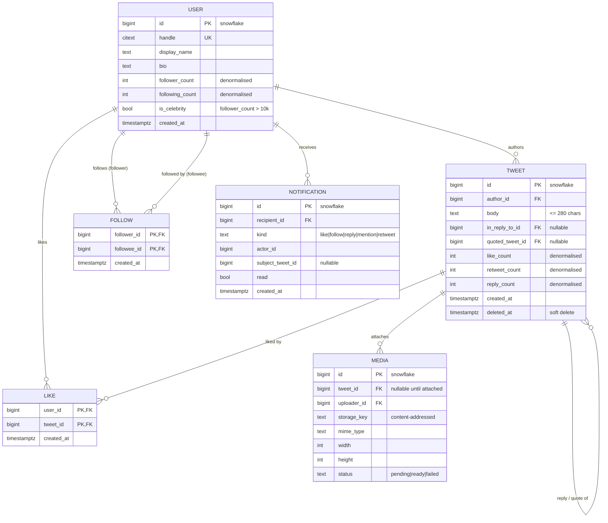

# Data Model

Each service owns its schema outright. No service reads another's tables — cross-service
reads go through gRPC, cross-service writes go through Kafka. Locally this is
schema-per-service inside one Postgres instance; in production it is separate instances.
The application code cannot tell the difference, which is the point: the boundary is
enforced in the access path, not in the deployment topology.

## Identifiers

Every user-visible entity uses a **Snowflake ID**: a 64-bit integer, time-sortable, with no
coordination required to generate one.

```
 1 bit    41 bits              10 bits        12 bits
┌──────┬───────────────────┬──────────────┬──────────────┐
│unused│ ms since epoch    │ machine id   │ sequence     │
└──────┴───────────────────┴──────────────┴──────────────┘
         ~69 years           1,024 nodes    4,096 per ms per node
```

Consequences worth naming, because they are why this is not a UUID:

- `ORDER BY id DESC` is `ORDER BY created_at DESC`, for free, with no second index
- Cursor pagination is `WHERE id < :cursor LIMIT 50` — no `OFFSET`, and no items skipped
  when new rows arrive mid-scroll
- Sequential inserts keep the B-tree dense, where random UUIDs fragment it
- 8 bytes, so it fits a native `BIGINT` and a Redis integer-encoded list entry

Full reasoning: [`concepts/snowflake-ids.md`](concepts/snowflake-ids.md).

## Entity overview



The FK arrows describe *logical* relationships. Across service boundaries they are not
enforced by the database — `tweets.author_id` points at a row the Tweet service cannot see.
That is the cost of the split, and it is why deletion is soft and eventual rather than
cascading.

## Per-service schemas

### Identity — `identity.*`

```sql
CREATE TABLE users (
  id              BIGINT PRIMARY KEY,           -- snowflake
  handle          CITEXT UNIQUE NOT NULL,       -- case-insensitive by type, not by convention
  display_name    TEXT NOT NULL,
  bio             TEXT NOT NULL DEFAULT '',
  avatar_media_id BIGINT,
  follower_count  INTEGER NOT NULL DEFAULT 0,   -- denormalised, see below
  following_count INTEGER NOT NULL DEFAULT 0,
  is_celebrity    BOOLEAN NOT NULL DEFAULT FALSE,
  created_at      TIMESTAMPTZ NOT NULL DEFAULT now()
);

CREATE TABLE credentials (
  user_id       BIGINT PRIMARY KEY REFERENCES users(id),
  password_hash TEXT NOT NULL,                  -- argon2id
  updated_at    TIMESTAMPTZ NOT NULL DEFAULT now()
);

CREATE TABLE sessions (
  id                 BIGINT PRIMARY KEY,
  user_id            BIGINT NOT NULL REFERENCES users(id),
  refresh_token_hash TEXT NOT NULL,             -- never the token itself
  expires_at         TIMESTAMPTZ NOT NULL,
  revoked_at         TIMESTAMPTZ,
  user_agent         TEXT,
  created_at         TIMESTAMPTZ NOT NULL DEFAULT now()
);
CREATE INDEX ON sessions (user_id) WHERE revoked_at IS NULL;
```

Refresh tokens are stored hashed for the same reason passwords are: a database leak must
not hand over live sessions.

### Graph — `graph.*`

```sql
CREATE TABLE follows (
  follower_id BIGINT NOT NULL,
  followee_id BIGINT NOT NULL,
  created_at  TIMESTAMPTZ NOT NULL DEFAULT now(),
  PRIMARY KEY (follower_id, followee_id)
);

-- The fan-out path asks "who follows X" on every single tweet, so that direction
-- gets its own index rather than relying on the composite primary key.
CREATE INDEX follows_followee_idx ON follows (followee_id, created_at DESC);

CREATE TABLE follow_counts (
  user_id        BIGINT PRIMARY KEY,
  follower_count INTEGER NOT NULL DEFAULT 0,
  is_celebrity   BOOLEAN NOT NULL DEFAULT FALSE  -- follower_count > 10,000
);
```

`is_celebrity` is stored, not computed. Fan-out consults it on every tweet; a `COUNT(*)`
over `follows` at 5,800 events/s would be the single hottest query in the system.

### Tweet — `tweet.*`

```sql
CREATE TABLE tweets (
  id              BIGINT PRIMARY KEY,           -- snowflake
  author_id       BIGINT NOT NULL,
  body            TEXT NOT NULL CHECK (length(body) <= 280),
  in_reply_to_id  BIGINT,
  quoted_tweet_id BIGINT,
  retweet_of_id   BIGINT,
  like_count      INTEGER NOT NULL DEFAULT 0,
  retweet_count   INTEGER NOT NULL DEFAULT 0,
  reply_count     INTEGER NOT NULL DEFAULT 0,
  created_at      TIMESTAMPTZ NOT NULL DEFAULT now(),
  deleted_at      TIMESTAMPTZ
);

-- Profile timelines: newest-first by author. id DESC is chronological (snowflake).
CREATE INDEX tweets_author_idx ON tweets (author_id, id DESC) WHERE deleted_at IS NULL;
CREATE INDEX tweets_reply_idx  ON tweets (in_reply_to_id, id DESC) WHERE in_reply_to_id IS NOT NULL;

CREATE TABLE likes (
  user_id    BIGINT NOT NULL,
  tweet_id   BIGINT NOT NULL,
  created_at TIMESTAMPTZ NOT NULL DEFAULT now(),
  PRIMARY KEY (user_id, tweet_id)
);

-- The transactional outbox. Written in the same transaction as the row it describes.
CREATE TABLE outbox (
  id            BIGSERIAL PRIMARY KEY,
  aggregate_id  BIGINT NOT NULL,
  topic         TEXT NOT NULL,
  payload       JSONB NOT NULL,
  created_at    TIMESTAMPTZ NOT NULL DEFAULT now(),
  published_at  TIMESTAMPTZ
);
CREATE INDEX outbox_unpublished_idx ON outbox (id) WHERE published_at IS NULL;
```

The partial index on `outbox` matters more than it looks: the publisher polls "what is
unpublished" continuously, and once rows are published they must stop costing anything to
skip over.

### Media, Notification, Search

Media holds upload metadata against content-addressed storage keys, so identical bytes
deduplicate and every URL is immutably cacheable. Notification holds the per-recipient
feed. Search holds no Postgres schema at all — it is an OpenSearch index, and it is
disposable: delete it, replay `tweet.created` from offset zero, and it rebuilds.

## Denormalised counters

`follower_count`, `like_count` and friends are duplicated data, which is normally a smell.
Here it is deliberate: rendering one timeline page means 50 tweets each needing a like
count, and `SELECT count(*) FROM likes WHERE tweet_id = ?` fifty times per request is not
survivable.

The trade is stated plainly: **counters are eventually consistent.** They are updated by
Kafka consumers, they can drift under duplicate delivery, and a periodic reconciliation job
recomputes them from the source tables. Displaying a like count that is briefly off by one
is acceptable. Taking 50 aggregate queries per page view is not.

## Redis key schema

| Key | Type | Contents | TTL |
|---|---|---|---|
| `user:{id}:home` | List | Up to 400 tweet ids, newest first | 30 d, refreshed on read |
| `author:{id}:tweets` | List | Up to 400 of that author's tweet ids | none (celebrities only) |
| `tweet:{id}` | String | Serialised tweet body for hydration | 1 h |
| `user:{id}:profile` | Hash | Handle, display name, avatar | 1 h |
| `ratelimit:{scope}:{key}` | String | Token-bucket counter | window |
| `dedupe:fanout:{tweetId}` | String | Idempotency marker for consumers | 24 h |

Every one of these is a **cache**. Losing the entire Redis instance costs latency, never
data. That property is what makes it safe to run Redis without persistence tuned for
durability — and it is a property that has to be defended in code review, because the
tempting shortcut is always to let one of these become the only copy of something.

## Sharding, when it arrives

Not now — the trigger table says at ~500 GB or ~5,000 writes/s. When it does:

- **Tweets** shard by `author_id`, so a profile timeline stays on one shard. Sharding by
  `tweet_id` would spread every profile read across all shards.
- **Follows** shard by `followee_id`, because "who follows X" is the fan-out query and it
  must not scatter.
- **Users** shard by `user_id`.

Snowflake IDs make this a routing change rather than a data migration: the shard key is
already in the identifier.

## See also

- [`01-system-design.md`](01-system-design.md) — how these tables are read and written
- [`concepts/snowflake-ids.md`](concepts/snowflake-ids.md)
- [`concepts/transactional-outbox.md`](concepts/transactional-outbox.md)
- [`concepts/cqrs.md`](concepts/cqrs.md)
