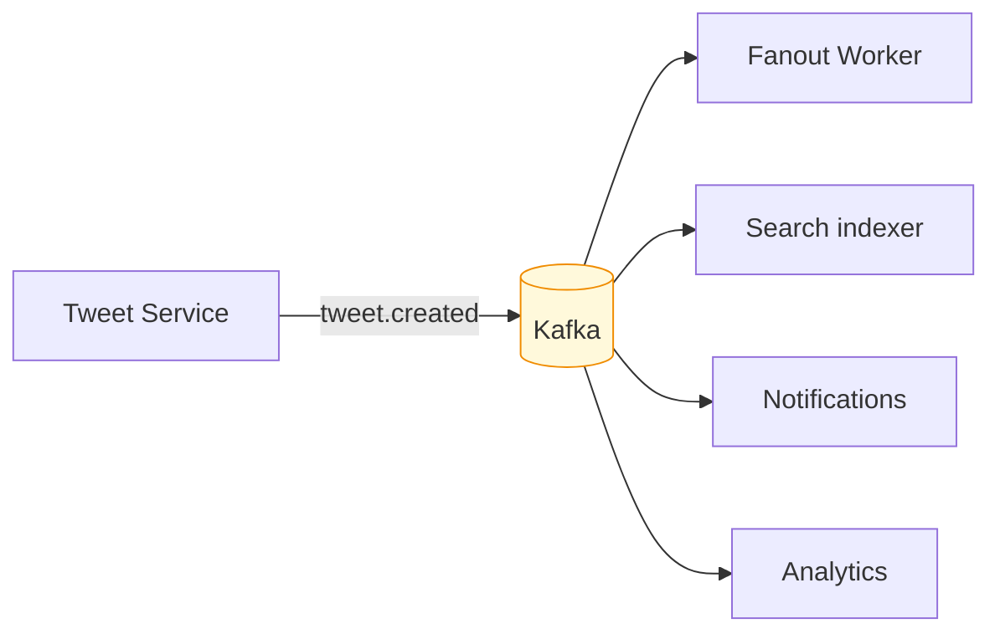

# Asynchronous event backbone

## The problem

You press "Tweet". What has to happen?

1. Persist the tweet
2. Fan out to followers' timelines
3. Index it for search
4. Extract hashtags, update trending counters
5. Notify mentioned users
6. Run content moderation
7. Update analytics

Do all seven synchronously and the HTTP request waits for all seven. Your p99 becomes the
**sum** of every downstream system's p99.

Worse is the coupling: if the search index is down, nobody can tweet. A secondary feature
has taken down the primary one.

## The decision

The Tweet service does step 1, publishes a `tweet.created` event, and returns `201`. Done
in ~20 ms. Steps 2–7 are independent consumers reading that event at their own pace.

Each consumer has its **own offset**. They cannot block each other, and adding a fifth
consumer requires touching no existing code.

## Why Kafka specifically

Not RabbitMQ, not SQS. The distinction is queue vs **log**:

| | Queue (RabbitMQ, SQS) | Log (Kafka) |
|---|---|---|
| After consumption | Message is gone | Message remains, bounded by retention |
| Multiple consumers | Compete for messages | Each has an independent offset |
| Replay | Not possible | Read from any offset |
| Ordering | Best-effort | Guaranteed within a partition |

**Replay is the property that matters most.** It means every derived store becomes
disposable:

- Search index corrupted? Delete it, replay `tweet.created` from offset zero, it rebuilds.
- Notification consumer down for three hours? It resumes from its offset and catches up.
- Want a new read model — "timeline of videos only"? Write a consumer, replay, done. No
  migration, no change to any producer.

**Partition keys are chosen for ordering, not balance.** `tweet.created` is keyed by
`authorId`, so one author's create and delete land on the same partition in order. Keyed by
`tweetId`, a delete could overtake its own create.

## What it costs

This is the most expensive decision in the project. Naming the costs precisely:

### 1. Eventual consistency — permanently, everywhere

Your tweet exists but is in nobody's timeline for ~200 ms. The UI must handle it: render
optimistically from the `201` response rather than refetching, or the user watches their
own tweet fail to appear.

This cost does not stay in the backend. It reaches the interface.

### 2. At-least-once delivery

Kafka can deliver the same message twice — on rebalance, on retry, on a consumer crashing
between processing and committing its offset. **Every consumer must be idempotent.** A
redelivered `tweet.created` without a dedupe guard puts the same tweet in a timeline twice.

See [[idempotent-consumers]].

### 3. The dual-write problem

Writing to Postgres and publishing to Kafka are two operations that cannot be made atomic
by wishing. If the database commits and the broker call fails, the event is **lost with no
trace** — the tweet exists and will never reach a timeline.

Solved by the [[transactional-outbox]] pattern, which is not optional.

### 4. Operational surface

One more system to run, monitor and debug. Consumer lag becomes a first-class metric — it
is the backpressure signal for the whole system.

## In this repository

- Decision and alternatives: [ADR 0004](../adr/0004-kafka-as-event-backbone.md)
- Event contracts: [`04-api-contracts.md`](../04-api-contracts.md#kafka-event-contracts)
- Redpanda replaces Kafka locally — same protocol, one binary, no ZooKeeper

## Related

[[transactional-outbox]] · [[idempotent-consumers]] · [[cqrs]] · [[hybrid-fanout]]
