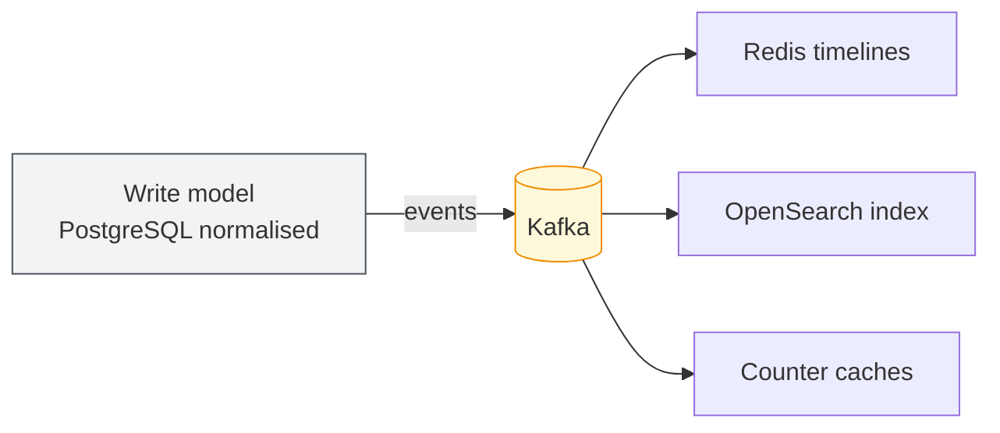

# CQRS — Command Query Responsibility Segregation

## The name is worse than the idea

The idea in one sentence: **the model you write to is not the model you read from.**

## The problem

Writes and reads want opposite things, and no single schema satisfies both.

**Writes want normalisation.** One tweet lives in exactly one row. Nothing is duplicated, so
nothing can disagree with itself. Foreign keys hold. Transactions are ACID. Correctness is
structural.

**Reads want everything pre-joined, pre-sorted, pre-aggregated,** in exactly the shape the
screen needs. Zero joins, zero aggregates, one lookup.

Try to serve both from one schema and you get the familiar bad trade: normalise properly and
every timeline page becomes a fan of joins and `COUNT(*)`s; denormalise for read speed and
every write must update five places, any of which can drift.

CQRS stops trying to reconcile them and keeps both.

## How it looks here

| | Write model | Read models |
|---|---|---|
| Where | PostgreSQL, normalised | Redis timelines · OpenSearch indices · counter caches |
| Status | **Source of truth** | Derived — disposable |
| Optimised for | Correctness, integrity, transactions | Latency and screen shape |
| Rebuildable | No — this is the original | Yes, entirely |

The link between them is the event log ([[async-event-backbone]]): the write model publishes
facts, and each read model builds itself by consuming them.

## The property that makes it worth the trouble

**Read models are disposable.**

- OpenSearch index corrupted, or you changed the mapping? Delete it, replay `tweet.created`
  from offset zero, it rebuilds itself.
- Redis lost everything? Timelines rebuild on demand from Postgres.
- Want a new view — "timeline of videos only", or a ranked timeline alongside the
  chronological one? Write a new consumer, replay the log, and it populates itself. **No
  migration. No change to the write model. No downtime.**

That last one is the real payoff. In a single-model system, a new way of reading data means
a schema migration and a risky deploy. Here it means a new process that reads a log.

## Not the same as event sourcing

These get conflated constantly.

- **CQRS**: separate read and write models. The write model still stores *current state* —
  `tweets` is a normal table with normal rows.
- **Event sourcing**: the event log *is* the source of truth, and current state is derived
  by replaying it.

This project uses CQRS **without** event sourcing. Postgres holds current state and is
authoritative; Kafka propagates changes. Event sourcing is a much larger commitment and is
not needed for anything here.

## What it costs

- **Eventual consistency**, again. Write to Postgres, read from Redis, and for a moment they
  disagree.
- **More moving parts.** Every read model is a consumer that can lag, crash, or drift.
- **Rebuild procedures must be real.** "We can always rebuild it" is a claim, and an
  untested claim is a wish. Each read model needs a rebuild path that has actually been run.
- **Debugging spans systems.** "Why is this tweet missing from search?" now involves
  Postgres, Kafka, the indexer, and OpenSearch.

## In this repository

- Read models: Redis timelines (Phase 4), OpenSearch (Phase 8), counter caches (Phase 3)
- Why counters are denormalised: [`03-data-model.md`](../03-data-model.md#denormalised-counters)
- Failure modes and rebuild paths: [`01-system-design.md`](../01-system-design.md#failure-modes)

## Related

[[async-event-backbone]] · [[timelines-as-id-lists]] · [[transactional-outbox]]
