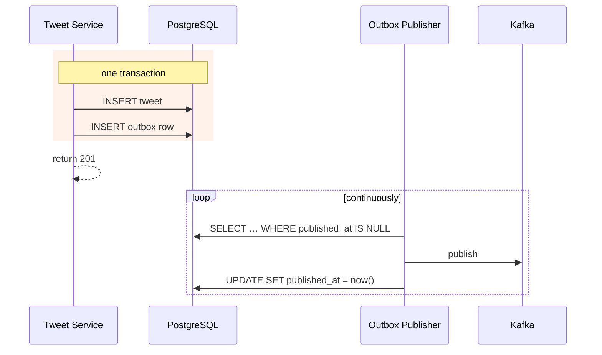

# The transactional outbox

## The problem: dual writes

The Tweet service must do two things when a tweet is posted:

```ts
await db.insert(tweet);           // 1. persist
await kafka.publish('tweet.created', event);  // 2. announce
```

These are two separate systems. There is no transaction spanning them. So consider what
happens when the process dies between line 1 and line 2 — or when the Kafka call times out.

**The tweet exists in the database and no event was ever published.** It will never be
fanned out, never indexed, never notified. It is invisible to everyone including its author's
followers, and **nothing anywhere records that this happened.** There is no error, no retry
queue, no log line. The data is silently, permanently inconsistent.

Reversing the order does not help — publish first and the process may die before the insert,
producing an event about a tweet that does not exist.

This is the **dual-write problem**, and it is one of the most common serious bugs in
event-driven systems precisely because it only manifests under failure conditions you do
not hit while developing.

## The solution

Make "the tweet exists" and "the event will be published" the **same atomic fact**, by
writing them to the same database in the same transaction:

```sql
BEGIN;
  INSERT INTO tweets (id, author_id, body, ...) VALUES (...);
  INSERT INTO outbox (aggregate_id, topic, payload)
       VALUES (:tweet_id, 'tweet.created', :json);
COMMIT;
```

One transaction. Either both rows exist or neither does. There is no interleaving that
loses the event.

A **separate publisher** then moves outbox rows to Kafka:



If the publisher crashes after publishing but before marking the row, it republishes on
restart — which is exactly why consumers must be idempotent ([[idempotent-consumers]]).
The outbox guarantees **at-least-once**, never exactly-once.

## Two ways to run the publisher

| | Polling publisher | CDC (Debezium) |
|---|---|---|
| How | `SELECT … WHERE published_at IS NULL` on an interval | Tails the Postgres write-ahead log |
| Latency | Poll interval (~100 ms) | Near-instant |
| Load | A query per interval, forever | None on the table |
| Complexity | A loop | Another distributed system to run |

This project starts with polling in Phase 3. It is comprehensible, debuggable, and adequate
at Tier 2. Debezium is a later option if the latency shows up in a trace.

The partial index matters either way:

```sql
CREATE INDEX outbox_unpublished_idx ON outbox (id) WHERE published_at IS NULL;
```

Without `WHERE`, the poll query gets slower every day as published rows accumulate.

## What it costs

- **An extra table and an extra process.** More moving parts for a failure mode you cannot
  see in development.
- **Publication latency** equal to the poll interval.
- **Table growth.** Published rows need periodic pruning, or the outbox becomes the largest
  table in the database.
- **Still at-least-once.** The outbox removes *lost* events; it does not remove *duplicate*
  events. Idempotency remains mandatory.

## In this repository

- Schema: [`03-data-model.md`](../03-data-model.md#tweet--tweet)
- Write path: [`01-system-design.md`](../01-system-design.md#the-write-path)
- Built in Phase 3

## Related

[[async-event-backbone]] · [[idempotent-consumers]] · [[cqrs]]
